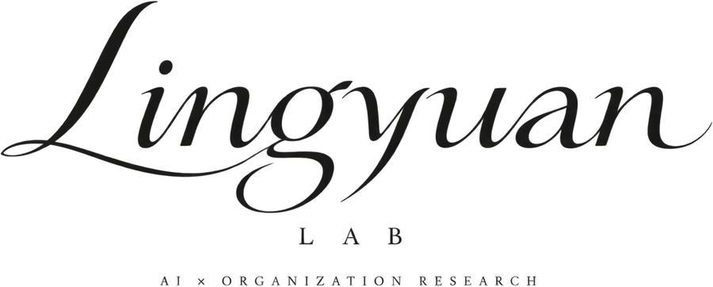
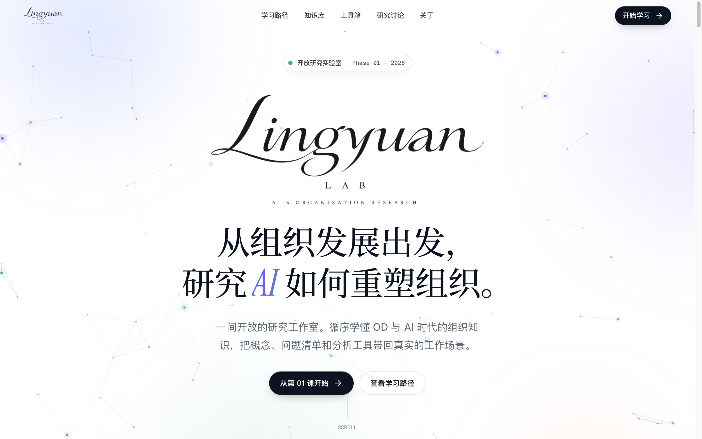
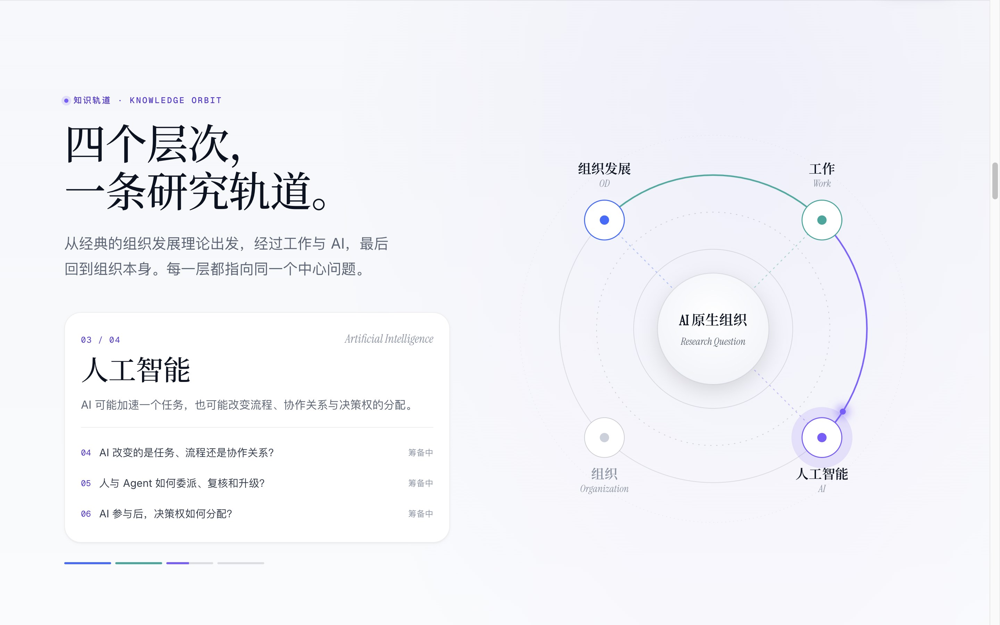
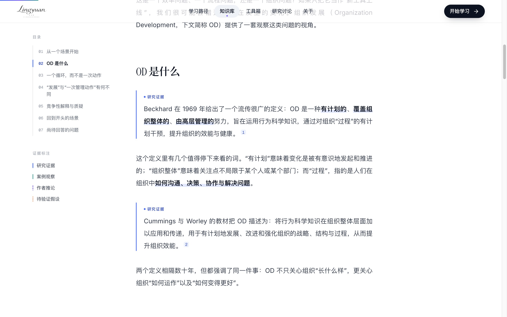

<p align="center">
  <picture>
    <source media="(prefers-color-scheme: dark)" srcset=".github/readme/logo-on-light.png">
    
  </picture>
</p>

<p align="center">
  <em>An open research lab exploring how AI reshapes work, decisions,<br>organizational design, and talent systems.</em>
</p>

<p align="center">
  
  
  
  
</p>

<br>

> **The AI-native organization is a research question, not an answer.**
> Lingyuan Lab starts from the classical canon of Organization Development and asks, carefully and in public,
> what actually changes when intelligence becomes a colleague.

<br>

<p align="center">
  
</p>

---

## The premise

Every generation of technology has promised to transform the organization, and every generation has learned the same lesson again: **tools change tasks, but people and structures decide what those tasks become.**

In 1951, Trist and Bamforth watched a new coal-mining method break apart the small, self-regulating teams that had made the old one work. The machines were not the story. The arrangement of human cooperation was. That observation became the seed of *sociotechnical systems* thinking, and it is the lens this lab brings to AI.

Models that draft, reason, and act as agents are arriving inside real teams. That raises the old questions in new forms:

- When an agent drafts the work, **where does judgment move?**
- When review becomes the bottleneck, **who owns the outcome?**
- When a process shifts, **do structure, rewards, and people shift with it, or do they quietly fall out of alignment?**

Lingyuan Lab is a place to study these questions slowly and rigorously, with the classics in one hand and the frontier in the other.

> **灵鸢** (*Líng Yuān*) roughly means *the nimble kite*. A kite rises only because it is held.
> Lift and tether, autonomy and structure: that tension is the subject of this lab.

---

## Four layers, one orbit

The curriculum follows a single research orbit. Each layer points back to the same unanswered question at the center.

<p align="center">
  
</p>

| Orbit | Layer | The question it holds |
| :---: | --- | --- |
| **01** | **Organization Development** | What does “development” change, beyond a one-off management action? Diagnosis, participation, intervention, feedback. |
| **02** | **Work** | What are tasks, roles, processes, and outcomes, and which of them is actually moving? |
| **03** | **Artificial Intelligence** | Does AI accelerate a task, rewire a process, or reshape who collaborates with whom, and who decides? |
| **04** | **Organization** | When work is redistributed, how must team boundaries, roles, and talent systems respond? |

---

## Every claim declares its provenance

Classical theory is not empirical proof about contemporary AI. So every paragraph that makes a claim is labelled with its epistemic status, visually, in the text itself.

| Label | Meaning | Mark |
| --- | --- | --- |
| **Research evidence** | Traceable literature, textbooks, or primary data, with edition and source | solid · blue |
| **Case observation** | Grounded in a specific setting, never generalized into a law | solid · teal |
| **Author inference** | The author's interpretation; competing explanations are expected | dashed · violet |
| **Open hypothesis** | Worth studying, not yet supported; counter-examples welcome | dotted · orange |

<p align="center">
  
</p>

Every article also carries its **research question**, its **scope and limits**, a **source list with verification status**, a **revision history**, and at least one **competing explanation**. No citation is published unless it can be traced to the original.

---

## The curriculum

Eight questions, one continuous path: from the foundations of OD to a first set of testable hypotheses about AI and the structure of work.

| # | Question | Companion artifact | Status |
| :---: | --- | --- | :---: |
| 01 | What does OD actually change? | Concept essay · glossary · diagnostic checklist | `draft` |
| 02 | How does an organization work? | Star Model diagram · organization observation sheet | `draft` |
| 03 | How do tasks, roles, processes, and outcomes differ? | Role-to-task decomposition template | `planned` |
| 04 | Does AI change tasks, processes, or relationships? | Three-kinds-of-change observation sheet | `planned` |
| 05 | How do humans and agents delegate, review, and escalate? | Collaboration & accountability flow | `planned` |
| 06 | Once AI participates, how are decision rights allocated? | Decision-scenario analysis sheet | `planned` |
| 07 | How should team boundaries and roles adjust? | Two design hypotheses, with counter-examples | `planned` |
| 08 | How must talent systems respond? | A research agenda for capability, development, and evaluation | `planned` |

Each lesson closes a deliberate loop:

```text
   Read an explanation  →  See a relationship map  →  Complete an exercise  →  Argue an open question
        (essay)               (interactive diagram)       (printable worksheet)      (moderated discussion)
```

---

## Architecture

A reading-first site with a strict separation of concerns: publications live in git, and only the discussion lives in a database.

```text
 Editors ──► Markdown / MDX in git ──► Astro build ──► static pages
 Readers ──► contribution form ─────► FastAPI /api/v1 ──► PostgreSQL (pending)
 Moderator ─► admin CLI ────────────► PostgreSQL (published, audited)
 Readers ◄── published contributions ◄── /api/v1
```

| Layer | Choice | Why |
| --- | --- | --- |
| **Frontend** | Astro 7 · MDX · content collections with Zod schemas | Static, fast, and typed down to every citation |
| **Motion** | GSAP ScrollTrigger (homepage only) · CSS View Transitions | Cinematic where it tells a story, absent where you read |
| **Typography** | Instrument Serif × Noto Serif SC · Inter · Geist Mono, all self-hosted | An editorial voice in two scripts; CJK fonts ship as unicode-range subsets |
| **Backend** *(next)* | FastAPI · pydantic v2 · psycopg 3 | A small, explicit, versioned JSON API |
| **Database** *(next)* | PostgreSQL 16 · plain SQL migrations | Runtime data only: topics, contributions, moderation events |

```text
frontend/    Astro site: pages, components, design tokens, content collections
backend/     FastAPI service, moderation CLI, tests                  (Phase C)
database/    SQL migrations, seeds, backup & restore runbook          (Phase C)
docs/        Brand and identity guidelines
plans/       Architecture, roadmap, acceptance criteria
assets/      The official wordmark
```

**Principles that are not up for negotiation**

- The frontend never touches the database; the backend never renders an article.
- Reading pages ship no animation runtime, only a few kilobytes of vanilla script.
- Contributions require no account, collect no names or emails, and are published only after human review.
- Reader content is always rendered as text, never as HTML.

---

## Craft

The interface is built to feel like an open research studio: white, luminous, and precise, with color kept for meaning.

- **A four-hue semantic palette.** Blue, violet, teal, and orange each carry one meaning across the whole site, whether it marks an orbit, an entry point, or an evidence type. Evidence is also coded by line style, never by color alone.
- **Motion with a purpose.** The homepage choreography: an ink-reveal wordmark, a manifesto that lights up character by character, a pinned orbit, and a horizontal curriculum rail. Everything else is quiet. Every animation respects `prefers-reduced-motion`.
- **Cross-document view transitions.** Page changes cross-fade natively, with no client-side router.
- **Interactive diagrams, not illustrations.** The OD change cycle and Galbraith's Star Model are keyboard-operable components with live descriptions.
- **Tools you can actually use.** Worksheets autosave locally, print cleanly, and export to Markdown.
- **Performance budget.** The homepage motion bundle is about 46 KB gzipped, and article pages do not load it at all.

---

## Getting started

```bash
cd frontend
npm install
npm run dev       # http://localhost:4321
npm run check     # type-check templates and content schemas
npm run build     # static output in frontend/dist
```

Requires Node ≥ 22.12. The discussion form proxies `/api` to `http://127.0.0.1:8000` in development; override it with `LINGYUAN_API`. Until the backend lands, the form degrades gracefully, and reading is never affected.

---

## Roadmap

- [x] **Phase A · Visual & content prototype**: design system, homepage, article, lesson and tool templates
- [x] **Phase B · Readable site (frontend)**: learning path, library with search and filters, glossary, toolbox, discussion UI
- [ ] **Phase B · Hardening**: accessibility contrast pass, focus management in pinned sections, sitemap, link checking
- [ ] **Content · Lessons 01–02**: human verification of every source, then publication
- [ ] **Phase C · Moderated discussion**: PostgreSQL schema, FastAPI service, moderation CLI, rate limiting, tests
- [ ] **Deployment**: same-origin `/api`, security headers, backups with a rehearsed restore
- [ ] **Phase D · Lessons 03–08**: new essays, diagrams, and tools, each held to the same editorial bar

The full, executable plan, with work packages and acceptance criteria, lives in [`plans/后续开发计划与验收标准.md`](plans/后续开发计划与验收标准.md). The founding architecture is in [`plans/网站架构与实施路线.md`](plans/网站架构与实施路线.md).

---

## Contributing & AI agents

This project is built with humans and AI models working side by side, which makes it a small case study of its own subject.

- **Agents** start with [`AGENTS.md`](AGENTS.md), then follow the work packages in `plans/`.
- **No model may mark a source as verified or an article as published.** Verification is a human act.
- The official wordmark in `assets/logo/` is never redrawn, recolored, or overlaid.

---

## A note on status

This is a **research preview**. The first two lessons are complete drafts, and every source in them is still marked *pending verification* on the site itself. Treat the content as a work in progress, and please do cite the originals, not us, until verification is complete.

---

## License

Written content is intended to be released under **CC BY 4.0** once published; the full license text will ship with the public launch.
The names **Lingyuan Lab / 灵鸢实验室** and the wordmark are **not** covered by the content license and remain reserved.

<br>

<p align="center">
  <sub><b>Lingyuan Lab · 灵鸢实验室</b><br>AI × Organization Research<br><br><i>Lift and tether.</i></sub>
</p>
